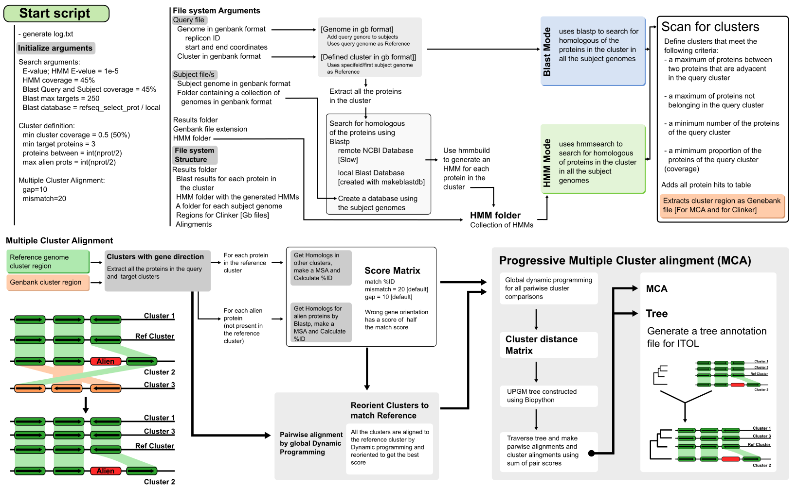

# Scan Cluster

:point_right: Run in Google Colab: [Scan cluster Colab](https://colab.research.google.com/drive/1-2OuKDcItqsDPRNqb1KkT2YLgDX_70Mv?usp=sharing)

# Methods
Scan Clusters is a program to look for homologous clusters in bacterial (but could also work on eukaryotes and viruses) genomes. If only a query cluster is provided the program will build HMMs for each gen in the cluster and then it will use hmmsearch to find the homologous genes in all the subject genomes. Homologous protein searches can be done in remote or local mode. For the remote mode, Scan_cluster will try to run blastp _-remote_ searches to retrieve homologous proteins. Then from the filtered blast results it will make the HMMs. In local mode, it will use a provided blast database or make a local Blast database from all the genomes to be analyzed, and run local blastp searches. From these searches the HMMs will be constructed. Alternatively, scan_cluster can search for clusters containing a predefined set of HMM. Finally, it can search for homologous of the proteins in the query cluster using blastp instead of hmmsearch.

A cluster is then defined if there are multiple query protein hits in the same region of the target genome. 
The following criteria is used for cluster definition:
*n_prots_between argument specifies the maximum number of proteins allowed between two consecutive genes in the query cluster.
*max_alien_prots argument specifies the maximum number of proteins in the target cluster that are not present in the query cluster.
*min_target_prots argument specifies the minimum of query proteins required to be found in target cluster. Default=3.)
*min_cluster_coverage argument specifies the minimum of cluster coverage (proportion). Default=.5. The program will use as minimum half of the query proteins.

The best clusters are then compared by pairwise blastp and a multiple cluster alignment (MCA) is generated by a progressive algorithm using dynamic programming. The scoring scheme for the MCA uses the orientation and pairwise identity values between all proteins in the clusters. Gaps are introduced when alien genes are present in the target clusters or when query genes are missing.
The guide tree used in the MCA is reported jointly with an annotation file for ITOL.
The clusters are also exported in genbank format to perform the cluster analysis with _Clinker_ software.



## Command line arguments
```
usage: scan_cluster.py [-h] [-Q QFILE] [-R REPID] [-s CSTART] [-e CEND]
                       [-q QCLUSTER] [--Reference REFGENOME] [-f HMM_FOLDER]
                       [-S SFILE] [-F SFOLDER] [-E GBEXT] [-o RES_FOLDER]
                       [--overwrite] [--only_blastp] [-n PROTS_BETWEEN]
                       [-M MAX_ALIEN_PROTS] [-m MIN_TARGET_PROTS]
                       [--min_cluster_coverage MIN_CLUSTER_COVERAGE] [-g GAP]
                       [--mismatch_score MISMATCH]
                       [--local_blast_db LOCAL_BLAST_DB] [--Generate_local_db]
                       [--Blast_DB BLASTP_DATABASE] [--Blast_evalue EVALUE]
                       [--Blast_max_targets MAX_TARGET] [--Blast_qcov QCOV]
                       [--Blast_scov SCOV] [--hmm_evalue HMM_EVALUE]
                       [--hmm_cover HMM_COVER]

This program was designed to identify orthologous genes clusters.

options:
  -h, --help            show this help message and exit

Query cluster:
  -Q QFILE, --QueryFile QFILE
                        Query genome in Genbank format.
  -R REPID, --Replicon_ID REPID
                        Required for draft and multireplicon genomes.
  -s CSTART, --cluster_start CSTART
                        Genome cluster start location.
  -e CEND, --cluster_end CEND
                        Genome cluster end location.

To search or a cluster provided in Genbank format:
  -q QCLUSTER, --QueryCluster QCLUSTER
                        Query cluster in Genbank format.
  --Reference REFGENOME
                        Specifies the genome Gb file to be used as reference.

To search or a cluster with a defined set of protein HMMs:
  -f HMM_FOLDER, --hmm_folder HMM_FOLDER
                        Folder containing the HMM profiles for the proteins to
                        include in the cluster.

Target Genomes:
  -S SFILE, --SubjectFile SFILE
                        Subject genome in Genbank format.
  -F SFOLDER, --SubjectFolder SFOLDER
                        Folder containing the subject genomes in Genbank
                        format.
  -E GBEXT, --Genbank file extension GBEXT
                        Genbank file extension. Default .gb

Output Folder:
  -o RES_FOLDER, --Results_folder RES_FOLDER
                        Results folder name.
  --overwrite           Overwrite previous results.

Running mode:
  --only_blastp         Runs using only blast for the identification of
                        homolog proteins.

Cluster definition arguments:
  -n PROTS_BETWEEN, --n_prots_between PROTS_BETWEEN
                        Maximum number of proteins allowed between two
                        consecutive genes in the query cluster. Default = half
                        of proteins in the cluster
  -M MAX_ALIEN_PROTS, --max_alien_prots MAX_ALIEN_PROTS
                        Maximum number of proteins in the target cluster that
                        are not present in the query cluster. Default = not
                        limited (Number of proteins in cluster * 3).
  -m MIN_TARGET_PROTS, --min_target_prots MIN_TARGET_PROTS
                        Minimum of query proteins required to be found in
                        target cluster. Default=3.)
  --min_cluster_coverage MIN_CLUSTER_COVERAGE
                        Minimum of cluster coverage, proportion. Default=.5.
                        The program will use as minimum half of the query
                        proteins. If you are running only with HMMs, this
                        value should be the fraction of the HMM required in a
                        cluster.)
  -g GAP, --gap_penalty GAP
                        Gap penalty for cluster alignment. Default = 10
  --mismatch_score MISMATCH
                        Mismatch score for cluster alignment. Alignment of
                        genes that are not orthologs are penalized. Default =
                        20

Blast and HMMSearch options:
  --local_blast_db LOCAL_BLAST_DB
                        A local blastp database generated with makeblastdb
                        program... <Folder name>
  --Generate_local_db   A local blastp database will be generated from the
                        proteome of all the analyzed subject sequences...
  --Blast_DB BLASTP_DATABASE
                        Database for remote blastp, used to retrieve homologs
                        for HMM generation. Default=nr Available: nr,
                        refseq_select, refseq_protein, landmark, swissprot,
                        pataa, pdb, env_nr, tsa_nr
  --Blast_evalue EVALUE
                        E-value cut-off for remote blastp, used to retrieve
                        homologs for HMM generation.
  --Blast_max_targets MAX_TARGET
                        Maxímum number of targets for Blastp search.
                        Default=250
  --Blast_qcov QCOV     Query coverage percent for Blastp search. Default=45
  --Blast_scov SCOV     Subject coverage percent for Blastp search. Default=45
  --hmm_evalue HMM_EVALUE
                        E-value cut-off for hmmsearch. Default = 0.00001
  --hmm_cover HMM_COVER
                        HMM coverage cut-off for hmmsearch. Default = 45

```

Running in the default mode can be very slow, depending on the NCBI blast server load (runs -remote blastp searches).
Sequence coverages are set to 45% to improve cluster detection. Using 70% of query coverage some clusters were not found. 
Also the maximum number of alien proteins (-M MAX_ALIEN_PROTS) and the maximum number of proteins allowed between two consecutive genes in the query cluster (-n PROTS_BETWEEN) should be adjusted for better sensibility.
To get more sensibility in the detection of distant clusters (with similar gene composition but different organization) the --only_blastp mode is not recommended. It should be used to gain speed only.

## Examples
### 1. Extract cluster from genbank file and search using remote blast to build HMM
```
./scan_cluster -Q <query genome gb> -R <Replicon ID as in the gb file> -s <int: start coordinate> -e <int: end coordinate> -F <Folder: folder with all the genomes to use as subject> -o <Folder: output folder>
```
### 2. Extract cluster from genbank file and search using local blast to build HMM
```
./scan_cluster -Q <query genome gb> -R <Replicon ID as in the gb file> -s <int: start coordinate> -e <int: end coordinate> -F <Folder: folder with all the genomes to use as subject> -o <Folder: output folder> --Generate_local_db
```

### 3. Search for clusters using HMMs provided by the user
```
./scan_cluster -f <HMM folder: folder with the HMM for genes in the cluster> -F <Folder: folder with all the genomes to use as subject> -o <Folder: output folder>
```

#### 4. Search using a genbank file only containing the cluster of interest and using the blast only mode
```
./scan_cluster -q <genbank cluster file>  -F <Folder: folder with all the genomes to use as subject> --only_blastp -o <Folder: output folder> 
```


# Install
`pip install requirements.txt`


## Required software
- HMMER
- blastp
- mafft

# Files
* install.py (install script)
* requiremnts.txt
* scan_cluster.py
* algorithm.png
* get_best_hit_table.py
* download_gb_from_tsv.py
* readme.md: this file

# Required third party python libraries
- Pandas
- Biopython

# Auxiliary scripts
## get_best_hit_table.py
Read the blast or HMMsearch results to search for the best hits for every gene in the query cluster in each of the target genomes. Produces a clustermap figure.
## download_gb_from_tsv.py
This scripts downloads the genomes by NCBI assembly accession number using NCBI's datasets.
Requires datasets and unzip programs.


